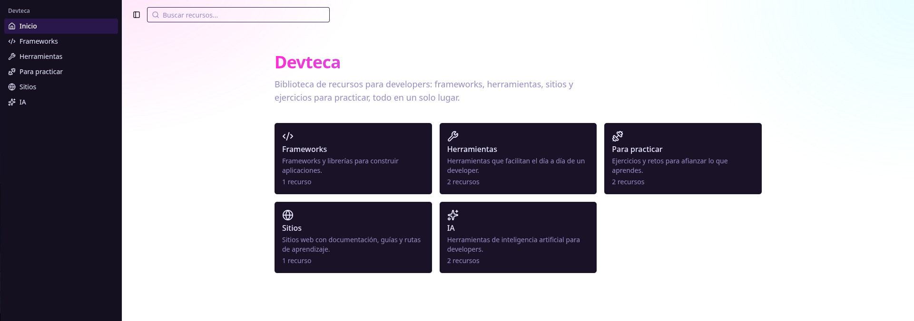

# Devteca

Biblioteca de recursos para developers: frameworks, herramientas, sitios de consulta y plataformas para practicar, reunidos en un solo lugar y con buscador.

🔗 **Demo:** https://devteca-ten.vercel.app/



## ¿Por qué existe?

Hay muchísimos recursos para aprender y trabajar como developer, pero están dispersos. Devteca los reúne en fichas cortas, organizadas por categoría, con una descripción y un enlace directo. Es un proyecto personal con el que practico desarrollo web full stack con tecnologías actuales.

## Funcionalidades

- Catálogo de recursos organizado por categorías: frameworks, herramientas, sitios, práctica e IA.
- Buscador que ignora mayúsculas y tildes, con la consulta guardada en la URL (se puede compartir un resultado).
- Página de detalle para cada recurso.
- Navegación con sidebar colapsable, adaptada a móvil.
- Tema oscuro de estilo cyberpunk, creado con variables CSS.
- Página 404 personalizada.

## Stack

| Área          | Tecnología                                 |
| ------------- | ------------------------------------------ |
| Framework     | [Next.js](https://nextjs.org) (App Router) |
| Lenguaje      | TypeScript                                 |
| Estilos       | Tailwind CSS                               |
| Componentes   | [shadcn/ui](https://ui.shadcn.com)         |
| Base de datos | PostgreSQL (Supabase, creada desde Vercel) |
| Despliegue    | Vercel                                     |

## Decisiones técnicas

- **Capa de datos desacoplada.** Las páginas no leen los datos directamente: llaman a funciones asíncronas (`getRecursos`, `getRecursoPorSlug`, `buscarRecursos`). Así se puede cambiar el origen de los datos sin tocar la interfaz.
- **Rutas dinámicas.** Una sola ruta `app/[categoria]` atiende todas las categorías, que se definen en un único objeto de configuración. El sidebar y la portada se generan a partir de ese mismo objeto, por lo que añadir una categoría no exige crear páginas nuevas.
- **Búsqueda en la URL.** El texto buscado vive en `?q=` y no en un estado local, con un pequeño retraso (_debounce_) para no actualizar la URL en cada tecla. Funciona el botón "atrás" y los resultados se pueden compartir.
- **Componentes separados por origen.** `components/ui` contiene los componentes de shadcn/ui; `components/my` contiene los propios, para no mezclarlos ni perderlos al actualizar la librería.
- **Tema con variables CSS.** Los colores salen de variables de `globals.css`, lo que permite cambiar toda la identidad visual desde un solo lugar.
- **Seed repetible.** El script que carga datos en Postgres usa `ON CONFLICT`, de modo que se puede ejecutar varias veces sin duplicar filas.

## Estado actual

- Los recursos se sirven desde un archivo de datos del repositorio (`lib/recursos.ts`).
- El esquema de PostgreSQL (tablas `tipos` y `recursos`) y el script de carga ya están creados, pero el sitio aún no lee de la base de datos.

## Próximos pasos

- [ ] Leer los recursos desde PostgreSQL.
- [ ] Formulario para proponer recursos, con moderación previa.
- [ ] Filtros por tipo en el buscador.

## Cómo ejecutarlo en local

Requisitos: Node.js 20 o superior.

```bash
git clone https://github.com/hstrelowdev/devteca.git
cd devteca
npm install
npm run dev
```

Abre [http://localhost:3000](http://localhost:3000). No necesitas configurar la base de datos para ver el sitio.

### Base de datos (opcional por ahora)

1. Crea un archivo `.env.local` con la URL de conexión:

```
   POSTGRES_URL=tu_url_de_postgres
```

2. Carga los recursos:

```bash
   npm run db:seed
```

## Estructura

```
app/            rutas (portada, categorías, recursos, búsqueda)
components/
  ui/           componentes de shadcn/ui
  my/           componentes propios
lib/            datos, categorías y funciones de acceso
scripts/        script de carga de la base de datos
```
